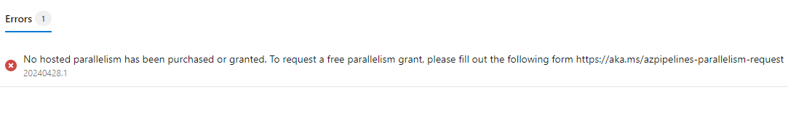
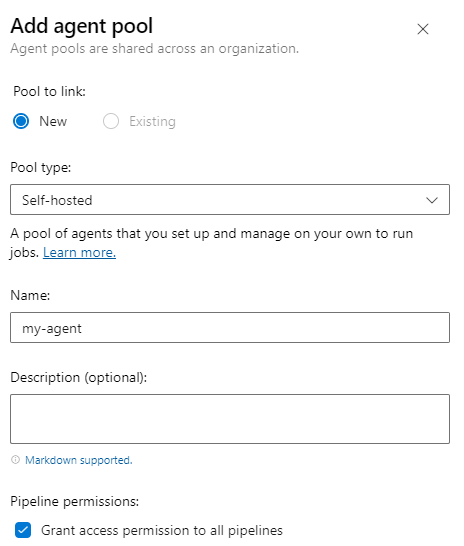

Devops Project


- 1. Command 
    mvn clean install
in webapp/target/ u find the webapp.war


- 2. Create a build pipeline

In azure devops portal, go to pipelines and then, create one


In connect, we select github


In select u select the repo that u need o want to have connected with this pipeline

In this example, this repo is a java based project so we are going to select in configurations a maven pipeline


we can run the maven pipeline example given by azure for the moment

azure-pipelines.yml```

    # Maven
    # Build your Java project and run tests with Apache Maven.
    # Add steps that analyze code, save build artifacts, deploy, and more:
    # https://docs.microsoft.com/azure/devops/pipelines/languages/java

    trigger:
    - master

    pool:
    vmImage: ubuntu-latest

    steps:
    - task: Maven@3
    inputs:
        mavenPomFile: 'pom.xml'
        mavenOptions: '-Xmx3072m'
        javaHomeOption: 'JDKVersion'
        jdkVersionOption: '1.8'
        jdkArchitectureOption: 'x64'
        publishJUnitResults: true
        testResultsFiles: '**/surefire-reports/TEST-*.xml'
        goals: 'package'


and then, we can press save and run


Now, we can maybe see an error




That agents are not free coz need cpu, ram, hard disk, etc and we can ask for rss to microsoft but the other solution is run the agent in our local machine and that is going to use our rss

Go to project settings/ agent pools / Add a pool

And in pool type select, self hosted with a name and description if u want and select the checkbox called grant access permission to all pipelines



So we click in the recently added agent, click on agent page and then in new agent and then follow the steps to download and run the agent inside of ur computer